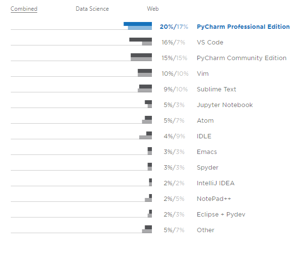
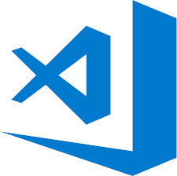
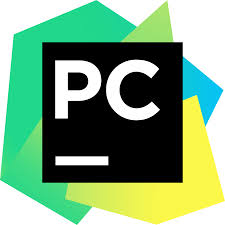
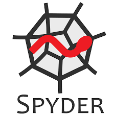

# The IDEs of March

PyLadies Melbourne meetup, March 2019

---
## Fun fact!
There is a Shakespeare Programming Language: http://shakespearelang.sourceforge.net/

*A programming language created with the design goal to make the source code resemble Shakespeare plays.*

*The characters in the play are variables. If you want to assign a character, let's say Hamlet, a negative value, you put him and another character on the stage and let that character insult Hamlet.*

---

...but we're here to talk about IDEs

---
## Python Developers Survey

...more than 18,000 responses collected in October and November of 2018

Which IDEs do python developers prefer?

https://www.jetbrains.com/research/python-developers-survey-2018/

---
### Survey Results
#### Key takeaways

1. **PyCharm** is the most popular IDE - 35% combined share for PyCharm Professional and Community editions.
1. **Visual Studio Code** is rapidly growing in popularity, and is now the second most popular IDE.

https://www.jetbrains.com/research/python-developers-survey-2018/

---
### Survey Results
#### Key takeaways

**Web developers have slightly different editor preferences from data scientists.** Web devs prefer PyCharm, VS Code, Vim, and Sublime text much more than data scientists do, while many data scientists prefer Jupyter Notebook as their primary tool.

https://www.jetbrains.com/research/python-developers-survey-2018/

---
### Survey Results

https://www.jetbrains.com/research/python-developers-survey-2018/

---
## What do we want in an IDE?

### Most popular features

* version control
* code autocompletion
* code refactorings
* writing unit tests, and
* using virtual environments for Python projects

https://www.jetbrains.com/research/python-developers-survey-2018/

---
## What do we want in an IDE?

### Also popular

* SQL databases
* debugging
* code linting
* ... also type hinting is now as popular as CI

https://www.jetbrains.com/research/python-developers-survey-2018/

---
## What do we want in an IDE?
### Least used features

* NoSQL databases
* Python profilers
* code coverage tools

https://www.jetbrains.com/research/python-developers-survey-2018/

---
## Comparison table

https://github.com/pyladiesmelbourne/ides-of-march/blob/master/comparison.md

| Feature  | VS code | Pycharm | Atom | Spyder | ViM | Sublime | Notepad++ |
| --- | --- | --- | --- | --- | --- | -- | -- |
| **Autocomplete**  | Yes  | Yes | Yes | Yes | Yes, with ctags | Yes | Yes |
| **Bracket matching** | Yes  | Yes | Yes | Yes | Yes | Yes | Yes |
| **Cross platform** | Windows, macOS, Linux | Windows, macOS, Linux | Windows, macOS, Linux | Windows, macOS, Linux | Windows, macOS, Linux | Windows, macOS, Linux | Windows |
| **Integrated debugger** | Yes | Yes | Yes | Yes | Yes, with plugin (vimpdb) | No | No |
| **Integrated terminal** | Yes | Yes, paid version only | Yes, with plugin | No (only ipython console with `!` magics) | Yes, with `:term` | No | Yes, with plugin |
| **Multi-language support** | Yes | Yes | Yes | No | Yes | Yes | Yes |
| **Price USD** | Free | $89/year (or free for the community version) | Free | Free | Free | $80 | Free |
| **Source control integration** | Yes | Yes | Yes | No | Yes, with plugin | Yes, with plugin | Yes, with nppgit plugin |
| **Unit testing** | Yes | Yes | Yes, with plugin | Yes, with plugin | Yes, with plugin | Yes, with plugin | No |
| **Markdown preview** | Yes | Yes, with plugin | Yes, with plugin | Yes, with plugin | Yes, with plugin | Yes, with plugin | Ye, with plugin |
| **Collaborative editing** | Yes, with plugin | Yes, with plugin | Yes, with plugin | No | Yes, with plugin | No | Yes, with plugin |
| **Remote file editing** | Yes, with plugin | Yes | Yes, with plugin | No | Yes | Yes, with plugin | Yes, with plugin |
| **License** | MIT | Proprietary (Apache 2 licencse for the community version) | MIT | MIT | GPL | Proprietary | GPL |
| **Plugin manager** | Integrated | Integrated | Integrated | ? | 3rd party | Yes, "Package Control" plugin | built-in |
| **Code analysis / linting** | Integrated | Integrated | Yes, with plugin | Integrated | Yes, with plugin | Yes, with plugin | Yes, with plugin | ? |
| **Find references** | Yes | Yes | ? | No | Yes (shift+3 or Shift+8) | ? | ? |
| **Go to definition** | Yes | Yes | Yes | Yes | Yes, with plugin and ctags | Yes, with plugin | Yes, with plugin |

---
## Battle of the IDEs
#### ...aka demo time!
---
### Visual Studio Code

---
### PyCharm

---
### Atom

---
### Spyder

---

## Summing up

---
